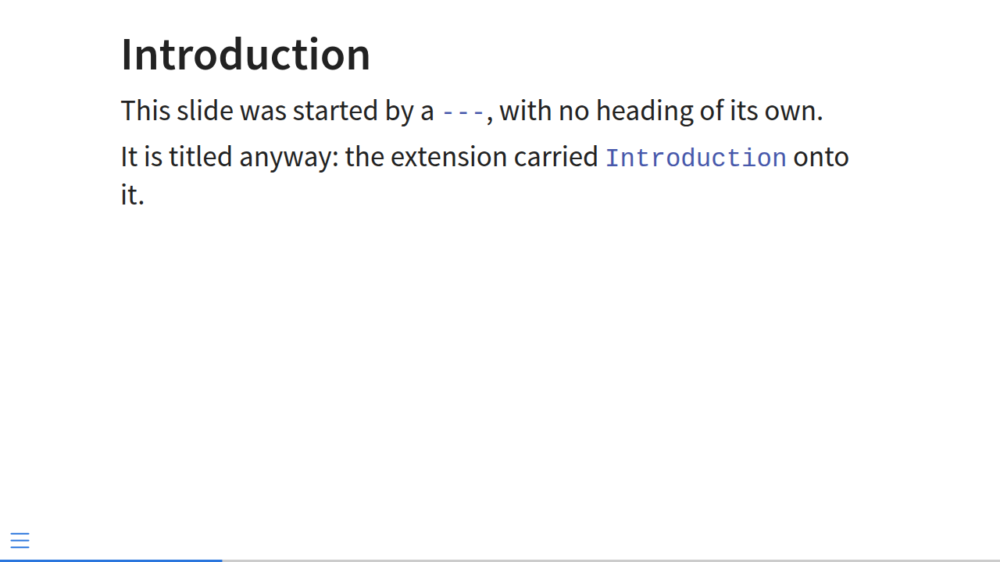
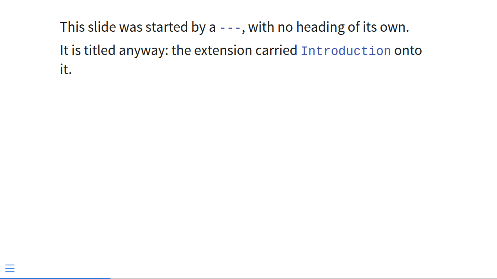

# title-slides

Carry the last `##` title onto untitled continuation slides in a Quarto presentation.

```sh
quarto add gortazar/title-slides@v0.1
```

## What it does

In a Quarto deck, a slide is started either by a heading or by a horizontal rule `---`.
A rule gives you a slide with no title, so a long section forces a choice: repeat
`## Introduction` by hand on every continuation slide, or let those slides render
untitled.

`title-slides` removes the choice. Write this:

````markdown
---
title: "My deck"
format: revealjs
filters:
  - title-slides
title-slides: true
---

## Introduction

blabla

---

more blabla

---

still more
````

and get the deck you would have got by typing the title out three times:

````markdown
## Introduction

blabla

---

## Introduction

more blabla

---

## Introduction

still more
````

## What it looks like

The second slide of `example/deck.qmd`, which is started by a `---` and has no heading
of its own. With `title-slides: true` it carries the title of the slide before it:



The same slide of the same deck with the extension switched off:



## Usage

Two keys in the frontmatter, both required:

- `filters: [title-slides]` loads the extension,
- `title-slides: true` switches it on.

Installing the extension therefore never changes how an existing document renders.

## The rule, exactly

Let *S* be the slide level (`slide-level` if you set it, otherwise 2). Walking the
top-level blocks in order, the filter tracks `current`, the most recent heading of
level *S*:

- a heading of level *S* sets `current`;
- a heading of a level **above** *S* — a section slide, `#` by default — clears it, so a
  section's title never leaks into what follows;
- for each top-level `---`: if the next block is a heading of level *S* or above, the
  slide already has its own title and is left alone. Otherwise, if `current` is set and
  some content follows, a copy of `current` is inserted right after the rule.

The inserted heading keeps the original's text and level. It gets a fresh identifier
derived from the original (`introduction`, then `introduction-cont-1`, …) so in-deck
links and the reveal menu keep working, and carries the class
`title-slides-continuation` so you can style or hide it:

```css
.title-slides-continuation h2 { opacity: 0.6; }
```

Cross-references to the original heading still point at the original slide.

`slide-level` is honoured: set `slide-level: 1` and it is `#` headings that are carried,
`slide-level: 3` and it is `###`. With `slide-level: 0` no heading starts a slide at all,
so there is no slide title to carry and the filter does nothing.

Attributes written on the original heading — `## Intro {.smaller background-color="red"}`
— are **not** copied onto continuations; only the text and the level are.

## Caveats

**Leave a blank line before `---`.** In markdown, a line of text followed immediately by
`---` is a *setext heading*, not a horizontal rule:

```markdown
blabla
---
```

parses as a level-2 heading titled "blabla" — the rule never reaches the filter, and you
get a slide titled `blabla` instead of a continuation slide. The filter warns when it
finds one in a `title-slides: true` document.

**Rules nested inside content are content.** A `---` inside a `:::` div, a `.columns`
block, a callout, speaker notes or a block quote is an ordinary horizontal rule and is
left alone; only top-level rules start slides.

**Supported format: `revealjs`.** That is where `---` breaks and `##` titles behave as
described.

**Quarto version.** The extension declares `quarto-required: >=1.4.0`, and falls back to
reading plain metadata where `quarto.metadata.get` is not available. It is tested against
Quarto 1.8.27, which is what the flake pins and what CI runs.

## Development

```sh
nix develop            # the pinned quarto, its pandoc, and the test runners
tests/run-unit.sh      # unit tests over the AST, under `pandoc lua`
tests/run-golden.sh    # filtered deck vs. the same deck written out by hand
tests/run-smoke.sh     # render example/deck.qmd and check the slides that come out
nix flake check        # everything CI runs
```

`example/deck.qmd` is a working deck using the extension; the screenshots above come
from it.
