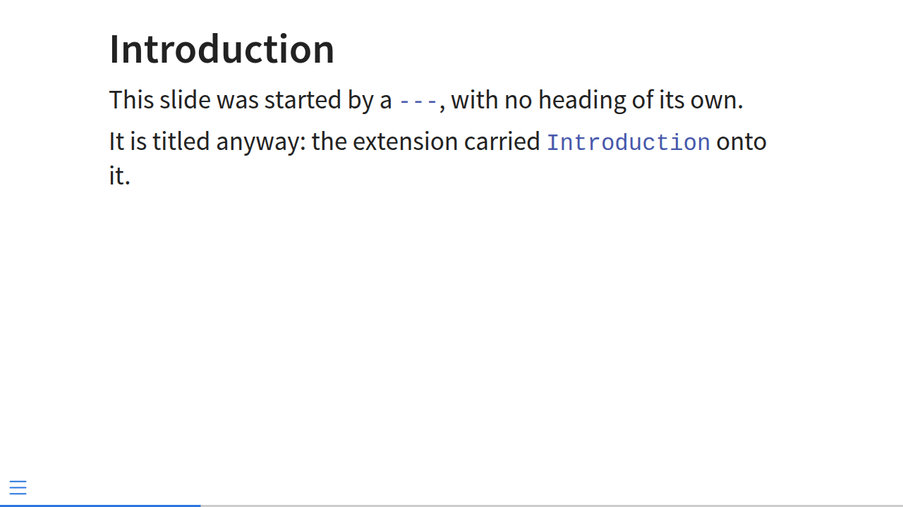
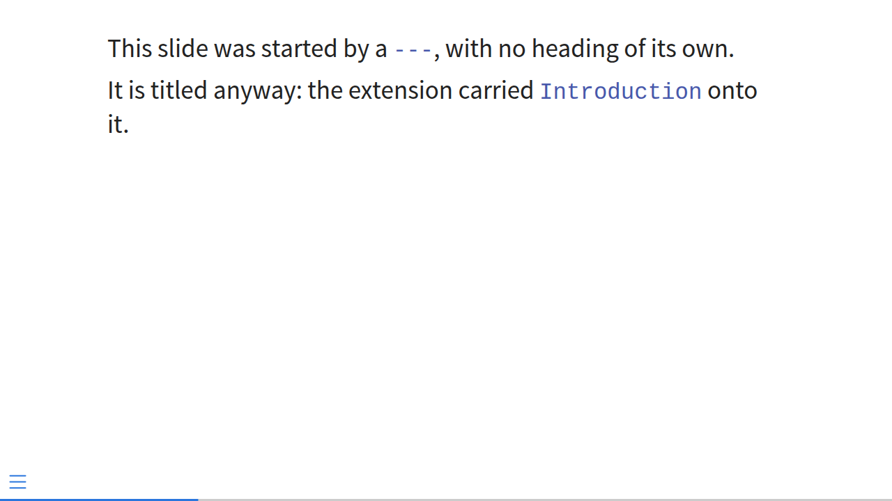
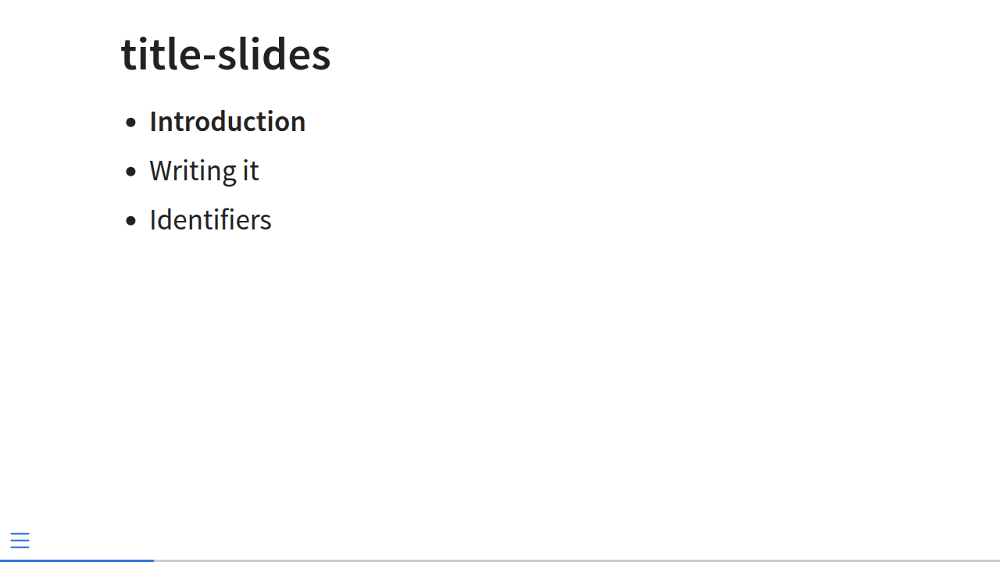
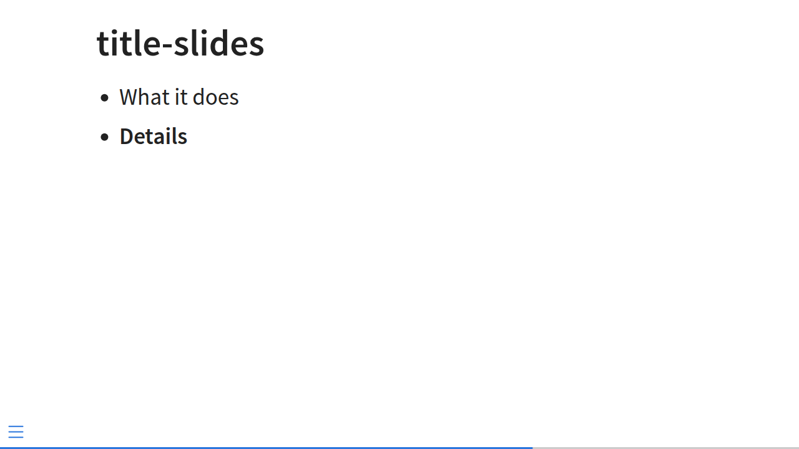

# title-slides

Two habits from beamer, brought to a Quarto deck:

- **carry the last `##` title** onto untitled continuation slides, and
- **put an index slide before every section**, with the section coming next in bold.

The two are independent — switch on either, or both.

```sh
quarto add gortazar/title-slides@v0.5
```

## Carried titles

In a Quarto deck, a slide is started either by a heading or by a horizontal rule `---`.
A rule gives you a slide with no title, so a long section forces a choice: repeat
`## Introduction` by hand on every continuation slide, or let those slides render
untitled.

`title-slides` removes the choice. Write this:

````markdown
---
title: "My deck"
format: revealjs
filters:
  - title-slides
title-slides: true
---

## Introduction

blabla

---

more blabla

---

still more
````

and get the deck you would have got by typing the title out three times:

````markdown
## Introduction

blabla

---

## Introduction

more blabla

---

## Introduction

still more
````

The second slide of `example/deck.qmd`, which is started by a `---` and has no heading
of its own. With `title-slides: true` it carries the title of the slide before it:



The same slide of the same deck with the extension switched off:



## An index before every slide

`show-index: true` puts an index slide in front of each of the deck's slides, listing the
deck's `##` titles and emboldening the one it introduces, so the audience always knows
where the deck is and where it is going. This is beamer's `\AtBeginSection` habit.

````markdown
---
title: "My deck"
format: revealjs
filters:
  - title-slides
show-index: true
---

## Beginnings

...

## Middles

...
````

Before `## Beginnings` and again before `## Middles`, you get:





## Usage

Loading the extension never changes how a document renders. `filters: [title-slides]`
loads it; each feature then has its own key, and you can set either or both:

| key | what it does |
| --- | --- |
| `title-slides: true` | carries the last `##` onto untitled continuation slides |
| `show-index: true` | puts an index slide before every section |

## The carry rule, exactly

Let *S* be the slide level (`slide-level` if you set it, otherwise 2). Walking the
top-level blocks in order, the filter tracks `current`, the most recent heading of
level *S*:

- a heading of level *S* sets `current`;
- a heading of a level **above** *S* — a section slide, `#` by default — clears it, so a
  section's title never leaks into what follows;
- for each top-level `---`: if the next block is a heading of level *S* or above, the
  slide already has its own title and is left alone. Otherwise, if `current` is set and
  some content follows, a copy of `current` is inserted right after the rule.

The inserted heading keeps the original's text and level. It gets a fresh identifier
derived from the original (`introduction`, then `introduction-cont-1`, …) so in-deck
links and the reveal menu keep working, and carries the class
`title-slides-continuation` so you can style or hide it:

```css
.title-slides-continuation h2 { opacity: 0.6; }
```

Cross-references to the original heading still point at the original slide.

`slide-level` is honoured: set `slide-level: 1` and it is `#` headings that are carried,
`slide-level: 3` and it is `###`. With `slide-level: 0` no heading starts a slide at all,
so there is no slide title to carry and the filter does nothing.

Attributes written on the original heading — `## Intro {.smaller background-color="red"}`
— are **not** copied onto continuations; only the text and the level are.

## The index rule, exactly

**The index lists the headings that start slides** — `##` at Quarto's default slide level.
Before each one, the filter inserts a heading at the slide level followed by a bullet list
of the deck's titles.

- **`#` is reserved for the title slide.** A level-1 heading is never listed and never gets
  an index slide in front of it, so a deck's title page and its `#` dividers are left
  exactly as written.
- **The heading** of the index is the document's own `title:`, or `Outline` if it has none.
- **Every slide title is listed**, in document order — not just the ones still to come — so
  the same list appears each time with the emphasis in a different place.
- **Repeated adjacent titles are listed once.** A topic continued across three slides
  under the same `##` gets one entry, emphasised for all three. A title that comes back
  later in the deck is a separate entry, in its own place in the running order.
- **The entry for the slide that follows** is wrapped in `Strong` *and* in a span with the
  class `title-slides-index-current`, so it is emphasised in any renderer and can be
  restyled from CSS.
- **Entries are plain text**, not links.
- **Hidden slides are left out.** A heading marked `.unlisted` or `visibility="hidden"` is
  neither listed nor given an index slide of its own, so `show-index` cannot leak the title
  of a slide you suppressed.
- **Continuation slides get no index.** The headings this extension generates are not
  listed, so using both features together does not put an index before every continuation.
- **Identifiers** follow the same scheme as continuations: `<slide>-index-<n>`, skipping
  any name already used. Index headings are also `unlisted`, so repeating them never
  fills up a table of contents.

**This doubles the length of a deck**, since every slide gains one in front of it, and
anything counting slides moves with it — `slide-number: c/t` totals, and any link that
names a slide by number.

Style them with the two classes:

```css
.title-slides-index h2 { font-size: 1.5em; }
.title-slides-index-current { color: #b5121b; }
```

`slide-level` applies here too, and the index follows it: at `slide-level: 1` the index
lists `#` headings and its own heading is a `#`; at `slide-level: 3` it lists `###`. Only
`slide-level: 0`, where no heading starts a slide at all, leaves it with nothing to list.

**A deck with no slide-starting headings gets no index and a warning saying so** — none
written, all of them hidden, or `slide-level: 0`. Nothing is invented in its place, so
asking for an index and receiving none is never silent.

## Caveats

**Leave a blank line before `---`.** In markdown, a line of text followed immediately by
`---` is a *setext heading*, not a horizontal rule:

```markdown
blabla
---
```

parses as a level-2 heading titled "blabla" — the rule never reaches the filter, and you
get a slide titled `blabla` instead of a continuation slide. The filter warns when it
finds one in a `title-slides: true` document. (It only affects the carry; `show-index`
does not look at rules at all.)

**Rules nested inside content are content.** A `---` inside a `:::` div, a `.columns`
block, a callout, speaker notes or a block quote is an ordinary horizontal rule and is
left alone; only top-level rules start slides. Likewise, only a top-level `#` counts as
a section: one nested inside a div is not indexed.

**An index slide shares its slide's vertical stack.** Where a deck uses `#` headings,
reveal groups the slides under each one into a vertical stack; an index slide sits in the
same stack as the slide it introduces, immediately before it, which is where it belongs
both on screen and in the overview grid.

**Supported format: `revealjs`.** That is where `---` breaks and `##` titles behave as
described.

**Quarto version.** The extension declares `quarto-required: >=1.4.0`, and falls back to
reading plain metadata where `quarto.metadata.get` is not available. It is tested against
Quarto 1.8.27, which is what the flake pins and what CI runs.

## Troubleshooting

### "Could not run … title-slides as a JSON filter"

```
Could not run /…/Material/title-slides as a JSON filter.
Please make sure the file exists and is executable.
Did you intend 'title-slides' as a Lua filter in an extension?
```

**This does not mean the filter is broken. It means Quarto never found the extension**, so
it fell back to reading `filters: [title-slides]` as a path to an executable, resolved it
against the document's own directory, and failed. The extension's code never ran.

Check what Quarto can see, **from the directory holding the `.qmd`**:

```sh
cd path/to/the/folder/with/your/deck
quarto list extensions
```

If that says `No extensions are installed in this directory`, that is the whole problem.
Install it there:

```sh
quarto add gortazar/title-slides@v0.5
```

You should end up with `_extensions/gortazar/title-slides/` **next to your document**, and
`quarto list extensions` should report `gortazar/title-slides`.

**Quarto does not search upwards for `_extensions/`.** An extension installed in the
parent folder is not found, and neither is one at the root of a `_quarto.yml` project when
the document lives in a subfolder — both produce exactly the error above. This is the
usual cause: `quarto add` was run in a different folder from the one that holds the deck,
which is easy to do in a tree of course material with a folder per topic.

Two things that are *not* the cause, checked against the real deck that prompted this
section: spaces and accents in the path are harmless, and a Quarto too old for the
extension reports itself plainly instead —

```
ERROR: The extension Title Slides is incompatible with this quarto version.
```

### The filter runs but nothing changes

Loading the extension is not enough; each feature needs its key. `filters: [title-slides]`
alone does nothing — add `title-slides: true`, `show-index: true`, or both.

### `show-index: true` and no index slides

Since 0.4 the extension tells you why, in a warning naming the key:

```
show-index is set, but no index slide was added: the deck has no `##` headings —
an index lists the headings that start slides, and there are none.
```

**A deck with no `##` headings has nothing to index.** From 0.5 the index lists the
headings that start slides, so a deck of `##` slides — the ordinary kind — is indexed, and
what is left to warn about is a deck with no slide-starting headings at all: none written,
every one marked `.unlisted` or `visibility="hidden"`, or `slide-level: 0`, under which no
heading starts a slide. The warning says which of the three it is.

Before 0.5 the index was keyed off `#` headings, so a deck of `##` slides got no index;
if that is what you are seeing, update.

If you get **no index and no warning either**, the extension that ran is not this version.
Check which one is installed, from the directory holding the document:

```sh
quarto list extensions
```

`show-index` did not exist before 0.2, the warning arrived in 0.4, and 0.5 is what
indexes `##` headings rather than `#`. An older install ignores the key in complete
silence — which is exactly how this was first reported. Update with
`quarto add gortazar/title-slides@v0.5`.

Two more things worth knowing:

- **`quarto render --quiet` suppresses the warning** along with everything else. Render
  without it when you are trying to find out why nothing happened.
- **`show-index:true` with no space after the colon is not YAML.** It is not a mapping
  entry at all, and Quarto stops with a parse error rather than rendering — so if your
  deck renders, this is not your problem. (Putting the key under `format: revealjs:`
  instead of at the top level is *fine*: Quarto folds format metadata into the document's,
  and the filter sees it either way.)

A deck with no top-level `---` likewise has nothing for `title-slides: true` to carry a
title onto; that one is silent, since a deck simply having no continuation slides is
unremarkable. `tests/fixtures/real-deck/` is a deck with neither, kept as a test.

## Development

```sh
nix develop            # the pinned quarto, its pandoc, and the test runners
tests/run-unit.sh      # unit tests over the AST, under `pandoc lua`
tests/run-golden.sh    # filtered deck vs. the same deck written out by hand
tests/run-smoke.sh     # render example/deck.qmd and check the slides that come out
tests/run-real-deck.sh # a real lecture deck, rendered the way a user renders one
tests/run-install.sh   # install the published release and render through it (needs network)
nix flake check        # everything CI runs bar the install test, which needs a network
```

`example/deck.qmd` is a working deck using both features; every screenshot above comes
from it.
